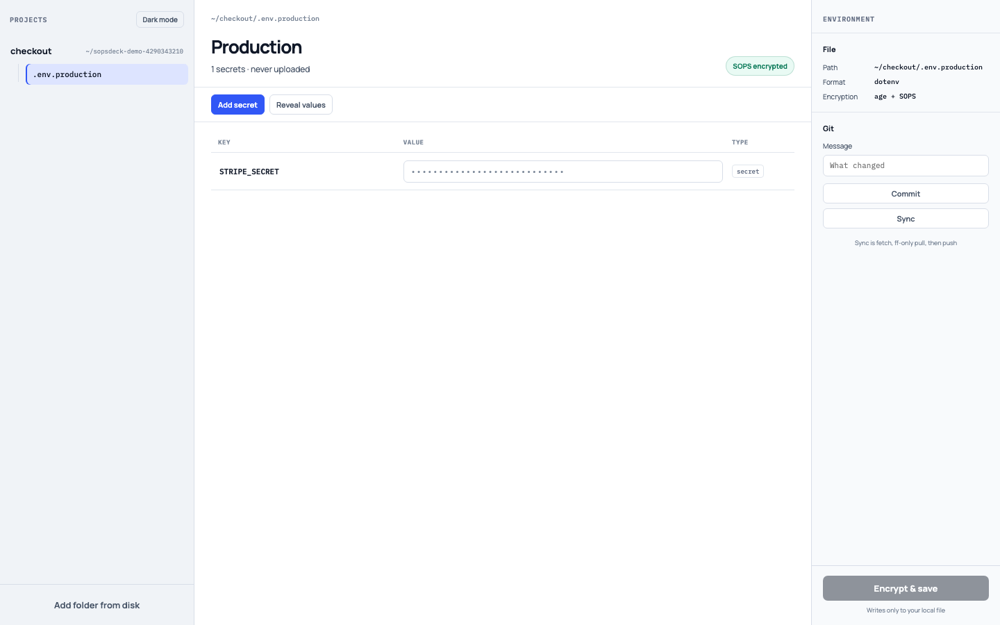

# Sopsdeck

Local-first workspace for SOPS-encrypted config (dotenv, JSON, YAML). Canonical site: [sopsdeck.com](https://sopsdeck.com).



Stills, short clips, and a studio walkthrough are generated by `./scripts/demo` and listed in [docs/assets.md](docs/assets.md).

## Prerequisites

- Go 1.25+
- system `git`
- for the desktop app: Rust (stable), bun, and a macOS machine
- for quality checks: gofumpt, golangci-lint, rustfmt, clippy

## CLI

```bash
go test ./internal/cli/
go build -o sopsdeck ./cmd/sopsdeck
```

First-run identity (Age key is not saved until you confirm a password-manager backup):

```bash
export SOPSDECK_STATE_DIR="$HOME/.sopsdeck"
./sopsdeck identity create --confirmed-backup
export SOPS_AGE_KEY_FILE="$SOPSDECK_STATE_DIR/age.txt"
```

```bash
./sopsdeck get KEY -f path/to/.env.production
./sopsdeck set KEY VALUE -f path/to/.env.production
./sopsdeck run -f path/to/.env.production -- your-command
./sopsdeck commit -m "rotate stripe" -f path/to/.env.production
./sopsdeck review -f path/to/.env.production
./sopsdeck sync
```

`sync` is `git fetch`, `git pull --ff-only`, then `git push`. It never force-pushes.

```bash
./sopsdeck recipient add AGE1... -f path/to/.env.production
./sopsdeck recipient remove AGE1... -f path/to/.env.production
./sopsdeck publish -f path/to/.env.production --prefix SD_ --yes
./sopsdeck files path/to/project
```

`publish` talks to `SOPSDECK_GITHUB_API` (real GitHub or the in-process fake). Without `--yes` it is a dry-run.

`./sopsdeck --version` matches the desktop app. Notes are [CHANGELOG.md](CHANGELOG.md); bump rules are [docs/versioning.md](docs/versioning.md).

## Drive the app from code

The desktop UI is the same HTML/JS as Tauri. `sopsdeck drive` serves it on localhost and accepts the same invoke commands over HTTP, so Playwright (or any client) can smoke-test the full app and capture screenshots. Team flows use a local **studio**: two throwaway Age identities, a bare git origin, and a fake GitHub Actions secrets API. No extra machine or GitHub account.

```bash
./sopsdeck drive --demo --listen 127.0.0.1:4174 --ui desktop/src
```

`--demo` seeds Alice's Project with `.env.production` and a local origin. Open http://127.0.0.1:4174/ — `GET /demo` returns Bob's public key (for Grant Access) and the Project path; `POST /invoke` matches Tauri commands.

```bash
./scripts/smoke   # studio teammate tests + Playwright against drive --demo
./scripts/demo    # stills, clips, and walkthrough into docs/assets/
./scripts/demo --check  # files exist and docs/landing link them (also in ./scripts/docs --check)
```

`./scripts/smoke` is not part of `./scripts/check` (browsers, slower).

## Desktop

The app shells out to the `sopsdeck` binary. Build that first, then:

```bash
cd desktop
bun install
SOPSDECK_BIN="$(pwd)/../sopsdeck" \
SOPS_AGE_KEY_FILE="$(pwd)/../testdata/age.txt" \
SOPSDECK_DEV_PROJECT="$(pwd)/../testdata" \
bun run tauri -- dev
```

`SOPSDECK_DEV_PROJECT` auto-opens a folder (handy with `testdata`). Omit it and use **Add folder from disk**. `testdata/age.txt` is a throwaway test key, not a personal identity.

## Landing page

```bash
python3 -m http.server 4173 --directory site
```

Open http://127.0.0.1:4173/ — [changelog.html](site/changelog.html) is generated from `CHANGELOG.md`.

## Quality

```bash
bun install        # prettier + xo at repo root
./scripts/fmt      # gofumpt, rustfmt, prettier
./scripts/check    # lint, tests, coverage floor, generated docs
./scripts/smoke    # local teammates + UI (not in check)
./scripts/demo     # product screenshots
./scripts/mutate   # mutation testing (slow)
```

Go uses gofumpt + golangci-lint. Rust uses rustfmt + clippy (pedantic/nursery, no unwrap/expect/panic/indexing in production code). JS/HTML/CSS uses prettier + xo. Install JS tools with `bun install` at the repo root, not npm.

Humans and agents should start at [docs/README.md](docs/README.md): domain language in `CONTEXT.md`, product decisions in `.scratch/sopsdeck-product/map.md`, and living feature/seams lists generated from tests.
