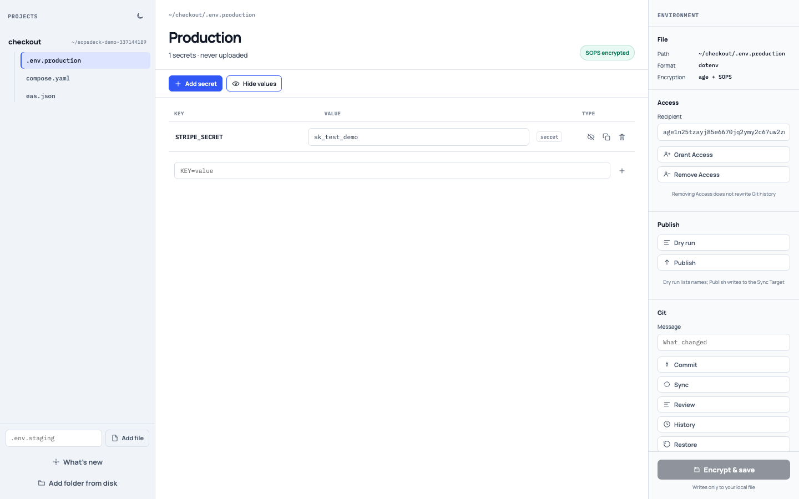
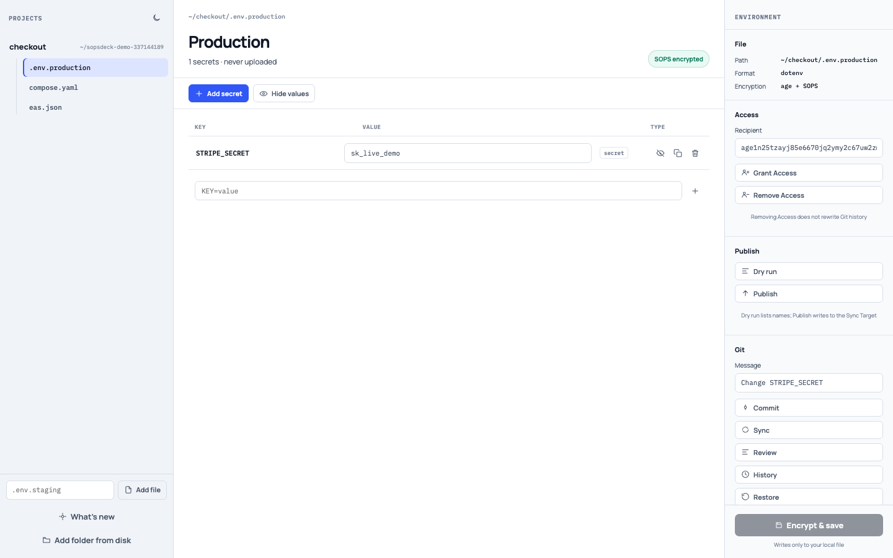
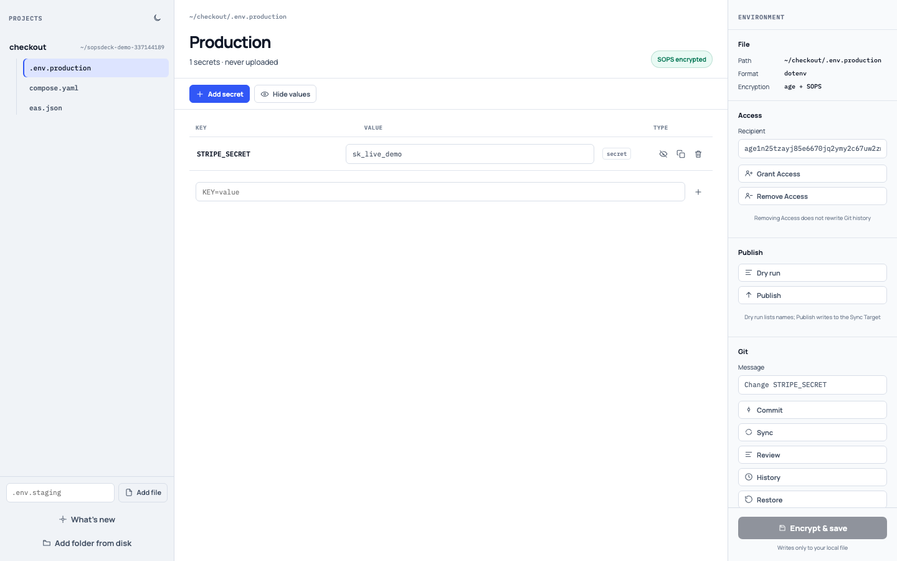
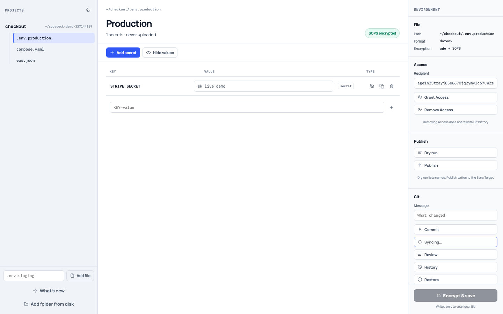
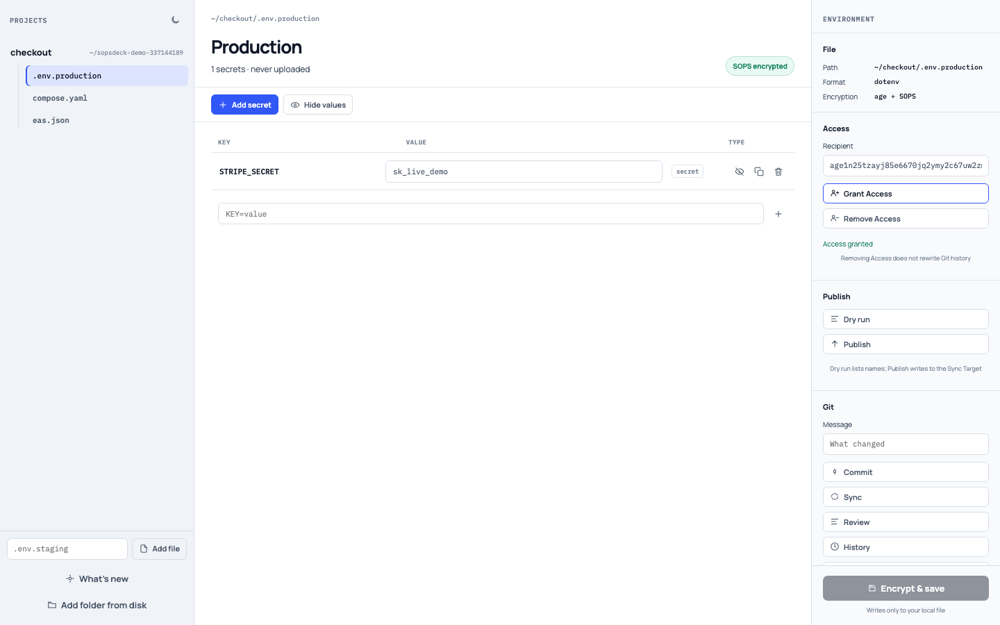
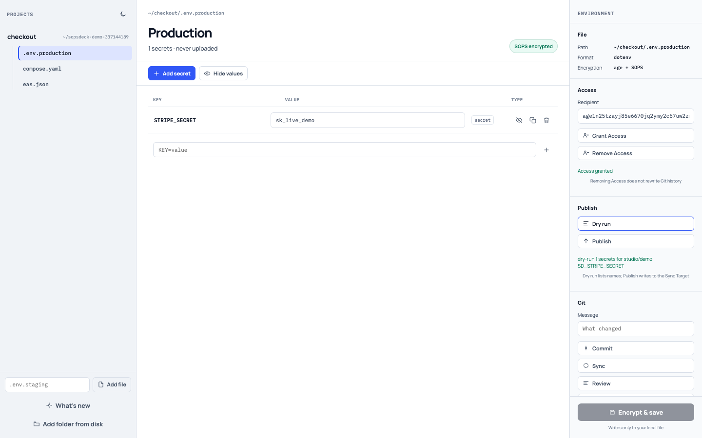

# Product assets

Generated by `./scripts/docs` from [catalog.json](assets/catalog.json). Stills, clips, and CLI casts come from `./scripts/demo`. Do not screenshot by hand.

## Walkthrough

Full studio path (open, edit, save, commit, Sync, grant Access, Publish): [walkthrough.webm](assets/walkthrough.webm)

## Stills and clips

| Action | Still | Clip |
| --- | --- | --- |
| Open a Managed File |  | [open.webm](assets/open.webm) |
| Reveal values |  | [reveal.webm](assets/reveal.webm) |
| Encrypt and save |  | [save.webm](assets/save.webm) |
| Commit |  | [commit.webm](assets/commit.webm) |
| Sync |  | [sync.webm](assets/sync.webm) |
| Grant Access |  | [grant.webm](assets/grant.webm) |
| Publish |  | [publish.webm](assets/publish.webm) |

## CLI casts

Recorded by `./scripts/demo` from real `sopsdeck` against copies of testdata. Asciinema v2 `.cast` files.

| Command | Cast |
| --- | --- |
| get a value | [cli-get.cast](assets/cli-get.cast) |
| set a value | [cli-set.cast](assets/cli-set.cast) |
| commit a Managed File | [cli-commit.cast](assets/cli-commit.cast) |
| Sync | [cli-sync.cast](assets/cli-sync.cast) |
